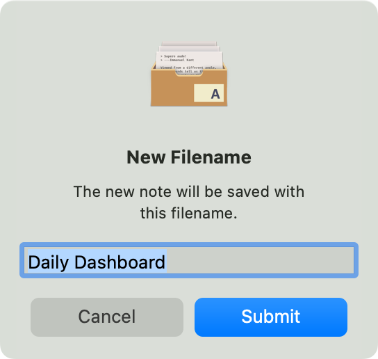

# API Documentation

These are the global variables that The Archive makes available to your scripts:

| Variable | Type     | Description                                                  |
|----------|----------|--------------------------------------------------------------|
| app      | Object   | Interface to (some) app remote control functionality.        |
| console  | Object   | Logs informational or error messages.                        |
| cancel   | Function | Immediately terminates script execution.                     |
| input    | Object   | Contains all app input ports (as requested by the Manifest)  |
| output   | Object   | Contains all app output ports (as requested by the Manifest) |

And these are the global functions:

| Function | Description                                                       |
|----------|-------------------------------------------------------------------|
| cancel() | Immediately abort script execution without performing any effect. |

## `app` Global Object

This global objects groups "remote control" functionality: things you want _The Archive_ to do on the user's behalf, and user interface interactions.

| Variable                | Type     | Description                             |
|-------------------------|----------|-----------------------------------------|
| app.extractNoteID(args) | Function | Returns the ID from e.g. a filename.    |
| app.prompt(args)        | Function | Prompt for user input.                  |
| app.search(args)        | Function | Search for notes like the user would.   |
| app.unusedFilename()    | Function | Generates a filename that's still free. |

### `app.extractNoteID(args)`: Returns the ID From a Filename

This is a call to what _The Archive_ uses to detect note ID's according to the user's settings.

As of v1.8.0, this will effectively extract date-time-stamps from filenames. Custom identifier schemes are not yet supported in the app. 

> Note: If you want to support your own identifier schemes (like Folgezettel ID's), you will need create your own extraction function. In future updates, you'll be able to let the user of your plug-in choose your function as a means to obtain ID's from note filenames. See discussion on [sharing data between plug-ins](https://forum.zettelkasten.de/discussion/3030/how-could-we-let-plug-ins-store-data).

```js
// Imagine you get a filename from a list of all notes:
const filename = "202410060932 My most amazing discovery";
const identifier = app.extractNoteID(filename);
// => "202410060932"
```

#### Parameters

| Name   | Type   | Description                                           |
|--------|--------|-------------------------------------------------------|
| `args` | String | Filename (or other piece of text) to get the ID from. |
|        |        |                                                       |

#### Returns

Either a string when a match is found or `null` if no match is found.

### `app.prompt(args)`: Prompting for User Input 

Interactively ask the user to provide text in a dialog:

```js
const filename = app.prompt({
  title: "New Filename",
  description: "The new note will be saved with this filename.",
  placeholder: "Filename",
  defaultValue: "Daily Dashboard"
});
```



The prompt's buttons are labeled "Submit" to confirm the input and send the result to your plug-ins JavaScript, and "Cancel" to dismiss the dialog and return `undefined` to JavaScript.

If the user hits the `Cancel` button or confirms with an empty text field, but you require non-empty input, you can abort script execution:

```js
if (filename === undefined || filename.trim() === "") {
  cancel("User did cancel instead of provide a filename.");
}
```

#### Parameters

| Name                | Type     | Description                                                    |
|---------------------|----------|----------------------------------------------------------------|
| `args`              | Object   | Arguments object with the following keys:                      |
| `args.title`        | String   | Prompt message, used as the title.                             |
| `args.description`  | [String] | Optional alert text explaining what the input will be use for. |
| `args.placeholder`  | [String] | Optional placeholder value for the text field.                 |
| `args.defaultValue` | [String] | Optional initial value displayed in the text field.            |

#### Returns

The text entered by the user on successful completion, or `null` if the prompt was canceled.


### `app.search(query, includeResults)`: Search for Notes

Since The Archive uses a "link as search" approach, you can use this both as a full text search and as a mechanism to resolve links:

```js
// Return search results for full text search:
const searchResults = app.search("some search");
 
// Only produce a best match, if any, to speed up link resolution.
const linkTarget = app.search("202411071201", false).bestMatch;
```

#### Parameters

| Name             | Type   | Description                                                                        |
|------------------|--------|------------------------------------------------------------------------------------|
| `query`          | String | Search string ("needle") to look for.                                              |
| `includeResults` | Bool   | Whether to produce a list of `results`, or only the `bestMatch`. (Default: `true`) |

#### Returns 

The search function returns an object of this rough form:

```json
{
  "results": [
    {"filename": ..., "content": ...},
    ...
  ],
  "bestMatch": {
    "filename": ..., 
    "content": ...
  }
}
```

- `results`: Array of note objects, sorted by the user's preference, or `null` if the `includeResults` parameter is set to `false`.
- `bestMatch`: Either a note object that is the best match for the search string, or `null` if no best match was found.

So when you set `includeResults` to `false` for efficient link resolution, and a best match is found, you get:

```json
{
  "results": null,
  "bestMatch": {
    "filename": ..., 
    "content": ...
  }
}
```

## `console` Global Object

- `console.error`: Function to log with the error level.
- `console.info`: Function to log with the informational level. Alias for `log`.
- `console.log`: Function to log with the informational level. Alias for `info`.

### `console.error(args)`: Logs Information to Indicate an Error

Logging errors this way doesn't affect how plug-ins are executed and the effect is merely decorative at the moment. Future development environment changes may react differently and help debug problems.

```js
if (!somePreconditionIsMet) {
    console.error("Could not ensure precondition (...)"); 
}
```

#### Parameters

| Name   | Type   | Description                         |
|--------|--------|-------------------------------------|
| `args` | String | Text to add to the log as an error. |

### `console.log(args)` or `.info(args)`: Logs Information

A call to `console.info(...)` has the same effect as `console.log(...)`: it adds a line of text to the log that you can access from _The Archive_'s "Debug" menu, or the log files.

```js
const identifier = app.extractNoteID(filename);
console.log("Extracted ID: " + identifier);
```

#### Parameters

| Name   | Type   | Description             |
|--------|--------|-------------------------|
| `args` | String | Text to add to the log. |


## `cancel(message)`: Abort Execution

To cancel plug-in execution, for example when an important pre- or postcondition cannot be met, use the global `cancel()` function to exit early before any effects are executed:

```js
const title = app.prompt(title: "Title For New Note");
if (title.trim() === "") {
  cancel("No title provided");
}
```


### Parameters

| Name      | Type     | Description                                              |
|-----------|----------|----------------------------------------------------------|
| `message` | [String] | Optional reason that shows up in logs to help you debug. |


## `input` Global Object

In general, you can only _read_ from the `input` object and its attributes. _The Archive_ will provide data to you, but you cannot change it. You can change a copy of the data, though, in case you want to e.g. filter notes:

```js
let allNotes = input.notes.all;
// ... change `allNotes` here ...
```

Overview: 

| Variable                 | Type             | Description                                              |
|--------------------------|------------------|----------------------------------------------------------|
| input                    | Object           | Holds the input ports as requested by the Manifest.      |
| input.notes              | Object           | Holds the note input ports as requested by the Manifest. |
| input.notes.all          | Array of Objects | Either all notes, or all searched notes.                 |
| input.notes.selected     | Array of Objects | Selected note, or notes.                                 |
| input.text               | Object           | Holds the text input ports as requested by the Manifest. |
| input.text.all           | String           | Full text of the currently edited note.                  |
| input.text.selected      | String           | Selected/highlighted text in the editor.                 |
| input.pasteboard         | Object           | Holds the input port for the system-wide pasteboard.     |
| input.pasteboard.content | [String]         | System-wide pasteboard's text content.                   |

## `output` Global Object

In general, you can write to almost all `output` ports, i.e. the innermost attributes in the `output` object.

> Note: You can't get all output ports at once, since e.g. the file output ports are mutually exclusive.

Actually, if you want to produce an effect like create a file, it is _expected_ that you change the file content -- even to an empty string! Otherwise, nothing will happen.

Notable exceptions are:

1. the `output.newFile.filename` attribute, which is always read-only, and provided by the app during execution of the script;
2. the `output.changeFile.filename` attribute, which is read-only in case your plug-in's Manifest file specifies a fixed filename, like so:

```json
{
...
  "output" : {
    "changeFile" : "Fixed Filename"
  },
...
}
```

In that case, `output.changeFile.filename` can be read and will return the string `"Fixed Filename"` in this case. If you use dynamic filenames that can be set from within the plug-in code, your Manifest has to specify it like so:

```json
{
...
  "output" : {
    "changeFile" : { "programmatic": true }
  },
...
}
```

Then the attribute can be written to like most of the others.

Overview:

| Variable                   | Type   | Description                                                                    |
|----------------------------|--------|--------------------------------------------------------------------------------|
| output                     | Object | Holds the output ports as requested by the Manifest.                           |
| output.changeFile          | Object | File output port to change (replace) a file with a known file name.            |
| output.changeFile.filename | String | File name of the file that's being replaced. (Mutable for dynamic file names.) |
| output.changeFile.content  | String | Content of the file that will be changed (replaced).                           |
| output.newFile             | Object | File output port to create a new file like the user would.                     |
| output.newFile.filename    | String | File name that will be created. (Read-only.)                                   |
| output.newFile.content     | String | Content of the file that will be created.                                      |
| output.insert              | Object | Editor text output port to insert content.                                     |
| output.insert.text         | String | Text to type on behalf of the user.                                            |
| output.pasteboard          | Object | Output port for the system-wide pasteboard.                                    |
| output.pasteboard.content  | String | Text to copy to the system-wide pasteboard.                                    |
| output.display             | Object | Output port for non-file-backed display of contents.                           |
| output.display.content     | String | Text to show in a separate window.                                             |
